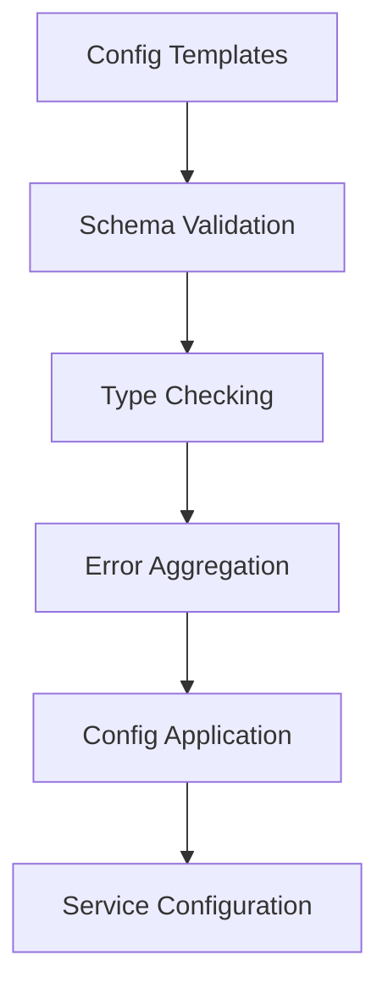
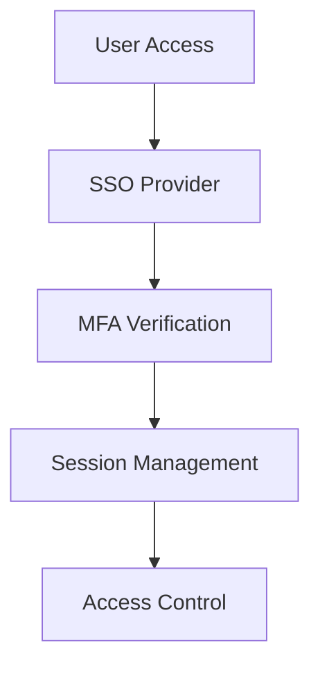
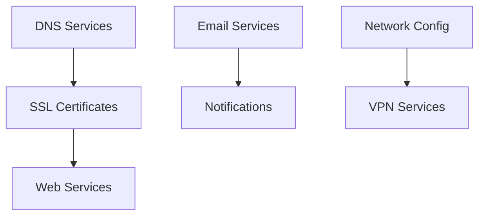

# Architecture Documentation

## System Overview

The GitLab Homelab infrastructure is designed as a modular, containerized system built on Kubernetes, with the following key architectural components:

### 1. Core Infrastructure

#### Kubernetes Orchestration
- Dynamic backend detection for different Kubernetes distributions
- Support for microk8s, k3s, and upstream Kubernetes
- Automated context and version management

#### Configuration Management
- YAML-based configuration templates
- JSON Schema validation
- Automated validation and type checking
- Error aggregation and reporting

### 2. Service Components

#### DNS Management
- Dynamic DNS configuration
- Multi-provider support (Cloudflare, Route53, Azure DNS)
- Automated record management
- SSL/TLS certificate automation

#### Authentication & Authorization
- SSO integration (Okta, Azure AD, Google)
- Multi-factor authentication
- Session management
- User provisioning

#### Email Services
- SMTP configuration
- Notification system
- Rate limiting
- Security features

#### Networking
- CIDR management
- Subnet configuration
- VLAN support
- VPN integration

### 3. Development Environment

#### DevContainer Setup
- Cross-platform development environment
- Pre-configured tools and dependencies
- Consistent development experience

#### Quality Assurance
- Automated testing
- Code quality checks
- Security scanning
- Performance monitoring

## Architecture Decisions

### 1. Kubernetes Distribution Support
- Dynamic detection for flexibility
- Distribution-specific optimizations
- Fallback mechanisms

### 2. Configuration Management
- Schema-first approach
- Strict validation
- Type safety
- Error aggregation

### 3. Security Architecture
- Zero-trust model
- Multi-factor authentication
- Secure defaults
- Regular security scanning

### 4. Development Workflow
- DevContainer-first approach
- Automated quality checks
- Comprehensive testing
- Documentation automation

## Component Interactions

### 1. Configuration Flow

### 2. Authentication Flow

### 3. Service Dependencies

## Performance Considerations

### 1. Resource Management
- Kubernetes resource quotas
- Service scaling policies
- Load balancing configurations

### 2. Optimization Strategies
- Caching mechanisms
- Resource limits
- Performance monitoring

### 3. Scaling Guidelines
- Horizontal scaling parameters
- Vertical scaling limits
- Auto-scaling policies

## Security Architecture

### 1. Authentication
- SSO integration
- MFA enforcement
- Session management
- Access control

### 2. Network Security
- VLAN segregation
- VPN access
- Firewall rules
- CIDR management

### 3. Data Protection
- Encryption at rest
- Transport security
- Backup strategies
- Access logging

## Monitoring Architecture

### 1. Metrics Collection
- Service metrics
- System metrics
- Custom metrics
- Alert thresholds

### 2. Logging
- Centralized logging
- Log retention
- Log analysis
- Alert correlation

### 3. Alerting
- Alert routing
- Notification channels
- Escalation policies
- Alert aggregation

## Future Considerations

### 1. Scalability
- Multi-cluster support
- Cross-region deployment
- Service mesh integration
- Load distribution

### 2. Integration
- Additional SSO providers
- Extended DNS providers
- New service types
- API extensions

### 3. Automation
- Extended CI/CD capabilities
- Automated recovery
- Self-healing
- Predictive scaling

## References

- [Configuration Documentation](../configuration/index.md)
- [Security Guidelines](../security/index.md)
- [Development Guide](../development/index.md)
- [Infrastructure Setup](../infrastructure/index.md)
